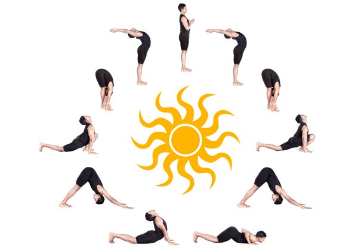

# YogShastra योगशास्त्र

Notes, for my name's sake!!

Objective is to compile understandings, from readings/watchings done on the topics of Yog, collectively called as Yog-Shastra (Science of Yoga).

Main theme would be YogSutra by Patanjali, a terse, loaded, no nonsense (no spiritual mumbo jumbo, u turns, etc) explanation of Yog

Notes are prepared in both, presentation and course-handouts formats. They are organized into following subtopics:
- Introduction
- Ashtang Yog (8 limbs of Yoga)
- Yog Sutra (Patanjali's Yog Sutra and interpretations)

## To Dos
- Prepare Sanskrit: Chinfo courses, read books
- Prepare body by Yogasana certifications
- Prepare breath by 3SRB

Wonderful to see fit and flexible, in those asanas!!

Meditation can not be done. It will happen. Prepare body and breathe-mind.

## Sadhguru Inner Enginering Workshop
- Paranayam: prana (breath, energy) aayaam (expansion, new dimension) prepares breath
- Pratyahaar: withdraw senses, see signals coming out and letting go
- Dharana: focus on breath or mantra and let go, it dies down later
- Dhyan: happens, from thinking to being, you are in meditation, or are meditation

- Resistance builds strength (mental and physical and social)

- GO SLOW, RELAX, NAP while sitting up, vacation in mind, mantra/breath as anchors
- Its never about goals, but enjoying the process
- Blissful and happy 24 hrs
- Don't try to be miserable, even in pain.... let go.

- Subconscious mind is the body, consciousness mind is thoughts. 
- Meditation happens when there are no thoughts but just the body, "chitta", that default state is blissful.

## Osho
The english word "Meditation" is wrong. It needs something to meditate upon. Whereas
 thats not what "dhyana" is. It is actually being 'in meditation' or 'is meditation'.
 
dhyana (sanskrit) => jhana (paali) => chaana (chinese) => zen (japanese).

## Naval Ravikant
- Still: In "The Secrets" Osho has mentioned 112 meditation techniques, originally mentioned in Sanskrit text "Vigyana BHairavi" a condensed set of recipes.
One that suited Naval is of Stillness. 1 hr, first thing in the morning, just sit still, in very comfortable position, back supported. Do this for 60 days.
Thoughts from past bubble up and they get sorted over time. A day comes when no such thoughts come and the INBOX becomes ZERO. You feel bliss.
- Meditation can not be done, it happens on its own.
- Happiness is state of lack of desires

## Zen Yoga by P J Saher and Dr Ashish Shukla
3SRB : 3 Step Rhythmic Breathing
3 steps: technique volume rhythm
Lie down, heavy book on naval, hands behind head, lift belly normally and not chest

Refinements for better breath-mind control:
1. Only Chest (123 (4) 56)
2. Only Belly (123 (4) 56)
3. Both chest and Belly in Pashchimottanasan, head up (123 (4) 56)
4. Breath in 5 installments, Blow out by mouth
5. 5-5-5-5 inhale keep exhale keep
6. Inhale, hold breath, touch chin, swallow 5 times

### Why Meditate?
* Change your Brain's Default Mode  https://www.youtube.com/watch?v=aAVPDYhW_nw&list=PLuOCYTZXw6HbE12JZGGD7-1aa_8BXyqLu&index=5 

# Yog 
- yuj: to unite: body and mind, atma to paramatma
- Keep it open source, anyone can add, but preserve core essence, spread it free
- Body as onion peels: स्थुल, सूक्श्म, अति सुक्श्म, आत्मा
- dhyan means attention, to thoughts like a witness 
- thoughts come from mind, truth is in no-mind state

## For further reading/watching
- Patanjali Yogasutra https://patanjaliyogasutra.in/
- Yoga Youtube channel https://www.youtube.com/playlist?list=PLAPrVB8wngPnPDrlpOeesA6WPv9auWJij
- Zenyoga Basic Course Ashish Shukla Spiritual Course https://www.youtube.com/watch?v=e3rCTV7OaoI&list=PLFLpZ_QuDbhGWwI2hoSaU9P4W7fUalOwx
- Patanjali Yoga Sutras | Explanation by Anandmurti Gurumaa https://www.youtube.com/watch?v=9oEfutjvAi0&list=PLTfDtaImcXfsvYGDfjxrEPQ03DgpVD7Tc&index=2&t=0s
- Patanjali's Yogasutra | Dr. Kausthub Desikachar https://www.youtube.com/watch?v=uG5h9h9cWxs&list=PLkcXr3YO0UgpYbQU_Tm8l9pZiCrlj1qCx
- Swami Rama SRC Youtube Channel https://www.youtube.com/user/SRCindia/videos
- YOGA SUTRA STUDY http://yogasutrastudy.info/yoga-sutra-introduction/
- Yoga Sutras of Patanjali by Dr. Bharat Thakur https://www.youtube.com/watch?v=yKq4ctrdPnQ&list=PL9Ee1tJEhfcTOR26FalrM6g9vOmltp7ad
- Importance of Yoga https://www.youtube.com/watch?v=oyr-I6z7j78&list=PL9Ee1tJEhfcTFjwWn3qtXjBrJzknVD7W6
- योग सूत्र का परिचय | Yoga Sutras of Patanjali | Yoga Sutras For QCI, UGC NET, Yoga All Exams https://www.youtube.com/watch?v=xN6E7JnJN18&list=PL0fP0X7ges95LdRQcreGvMDttS7MqJsAB
- Patanjali Yoga Sutras  https://www.youtube.com/watch?v=9oEfutjvAi0&list=PLTfDtaImcXfsvYGDfjxrEPQ03DgpVD7Tc
- Patanjali Yoga Sutra Dr Mrudula Chaudhari https://www.slideshare.net/gmmhfsyogateacherdiploma/patanjali-yoga-sutra-dr-mrudula-chaudhari
- Patanjali's Yogasutra | Dr. Kausthub Desikachar https://www.youtube.com/watch?v=uG5h9h9cWxs&list=PLkcXr3YO0UgpYbQU_Tm8l9pZiCrlj1qCx
- Master Class : Yoga Sutras of Patanjali https://www.youtube.com/playlist?list=PL3rUWZ1oaDcaJzyQonZbYTQqgrb2nZ2XL
- Patanjali Yogasutra Marathi  https://www.youtube.com/watch?v=kHrGwDBNNHs&list=PLAEwG9XjiVKjKGbbgPyb4DlN8sR-V5qRV&index=2
- Chinmaya Mission https://www.chinfo.org/index.php/downloads
- Swami Jnaneshvara Bharati https://www.swamij.com/ https://www.swamij.com/yoga-sutras-narrative.htm
- Yog Guru Dheeraj 
- Vyoma Sanskrit Pathshala 
- The Sanskrit Channel 
- Patanjali Yog Sutra Guru Maa, Rajen Vakil
- Zenyoga basic course on YouTube by Ashish Shuka
